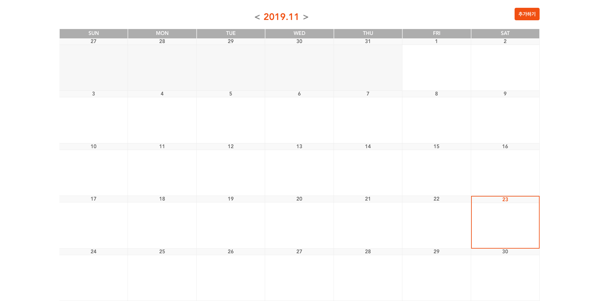
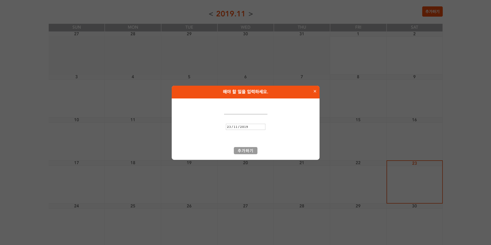
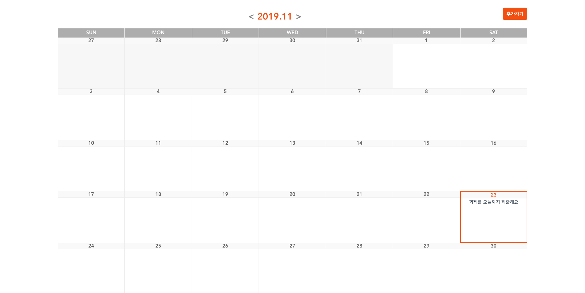
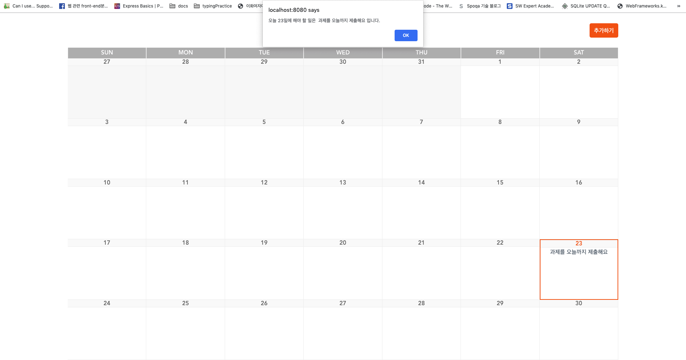
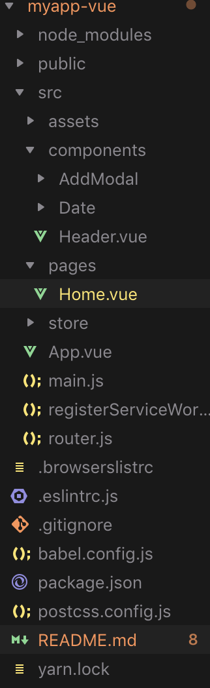

# 자소설 닷컴 프론트엔드 개발 지원 과제

* 프론트 엔드 지원자 김도우
* 작성일 : 2019. 11. 23

## 0. 완성 결과물

**메인 화면**


**할일 추가 모달 화면**


**할일이 추가된 화면**


**날짜를 눌렀을 때 alert**


## 1. 목표

* 자소설 닷컴 채용 화면에서 사용하는 달력 UI를 구현 할 것.
* Vue를 제외한 다른 라이브러리의 사용을 하지 않을 것
* CSS library를 사용하지 않고 직접 CSS(SCSS)로 구현 할 것.

## 2. 프로젝트 실행 방법

* myapp-vue 디렉토리에 들어 간 후, `package.json`에 입력된 라이브러리를 설치합니다.
* 이후 `npm run serve` 또는 `yarn serve`로 vue 개발 서버를 실행합니다.

```bash
cd myapp-vue
myapp-vue > npm i (yarn)
myapp-vue > npm run serve (yarn serve)
```

## 3. 프로젝트 구축 환경

* Package Manager로 `yarn`을 사용하였습니다.
* `vue 2.6.10`,  `vue-cli 3.7.0`
* `SCSS` 를 활용하기 위해 `node-sass`, `sass-loader` 를 사용하였습니다.
* Production 환경이 아닌 Dev 환경으로 구축하였습니다.
* vue-cli로 프로젝트 생성시 기본 설정되는 `es-lint`와 `prettier`를 활용하여 작업을 진행하였습니다.

## 4. 디렉토리 구조



* `main.js` 에서는 Vue와 관련된 셋팅을 담당하고, `App.vue`를 main.js에 등록합니다.
* `store` 는 상태관리를 위한 디렉토리로써, `vuex` 관련된 셋팅과 더불어, `module`화를 통해 vuex를 분리하고, 각각의 기능(calendar, todo)로 나누어 모듈화를 진행하였습니다.
* `pages` 디렉토리는 vue-router를 활용할 때 지정된 URL 로 이동할 때 렌더링 하는 컴포넌트(페이지) 를 담당하는 디렉토리 입니다. 저는 `Home.vue` 파일을 만들어서 랜딩 페이지시 Home.vue가 렌더링 하게 만들었습니다.
* `Components` 는 컴포넌트를 두는 폴더입니다. 저는 `Modal`, `Date`, `Header`로 나누어 작업을 진행하였습니다.

## 5. 해결 과정

### 1) vue-cli 로 클라이언트 프로젝트 구축

* vue-cli로 프로젝트를 생성하고 eslint, babel, webpack, node-sass등 vue-cli에서 지원하는 기본 설정을 활용했습니다.

### 2) Header Component 구성

* 연, 월을 나타내고, 이동하는 버튼과 추가하기 버튼을 만들었습니다.
* JS로 데이터를 변하는 로직은 나중에 구현하고, 일단 컴포넌트와 CSS 부터 조금씩 작성하였습니다.

### 3) Date Component 구현

가장 많은 시간이 걸렸습니다. 일단 영어로 요일이 나오고, 그 밑에 그달에 속하는 일들을 입력하는 컴포넌트들을 만들어야 겠다고 생각했습니다.

* `Days` 컴포넌트는 영어로 요일을 나타내는, 헤더 바로 아래의 컴포넌트 입니다. 이것을 만들때 까지만 하더라도 생각보다 쉽게 만들 수 있을 것이라 생각했습니다. 별다른 로직 없이 요일을 일요일부터 토요일 까지 배열로 만들고, 이를 반복 렌더링을 통해 구현했습니다.

* `Dates` 컴포넌트는 해당월의 모든 `일`을 나타내는 컴포넌트 입니다. 한 주를 담당하는 컴포넌트를 만들기 위해, 그 달이 몇주가 있는지 계산하고, 1일이 있는데 그게 일요일이 아닌경우, 어떻게 빈칸을 만들 어 칸을 띄운 후 원하는 요일에서 1일이 시작하게 할 지 고민했습니다.
  
  * 이 부분을 해결하기 위해 한주를 반복문 할때 나오는 인덱스 값과, 1일의 getDay() 값을 계산하여 비교한다음, 이전달의 날짜들을 계산하는 방식으로 진행하였습니다.

* `DateItem` 의 경우 `해당 일` 에 속하는 컴포넌트 입니다.  `Date` 에서 `index` 와 `week` 값을 받아와서, 이를 계산하여 자신의 날짜를 계산하게 하며, 자신이 `Today`일 경우, 그리고 `Todo` 추가시 렌더링 등을 이 컴포넌트에서 작업 하였습니다.

* `AddModal` 컴포넌트는 `Todo`를 입력하는 컴포넌트로써, 할 일을 입력하고, 날짜를 정하는 컴포넌트 입니다.

## 6. 헤맸던 점

* 달력 라이브러리를 사용하는 것 보다, 직접 구현하는게 제 실력을 키우는 점에서도, 자소설 닷컴 측에서 제 실력을 파악하기에도 좋을 것이라 생각을 했습니다. 자바 스크립트에서 `Date` 객체 덕분에 편하게 작업 할 수 있었지만, 일요일부터 시작해서 토요일로 끝날 때, 해당 1일의 시작 요일에 따른 컴포넌트 위치를 계산하는 알고리즘을 구현하는 것에서 제법 헤맸습니다. 구현은 하긴 했으나, 더 좋은 알고리즘이 있을 것이고, 추가적으로 음력 달력 및 공휴일을 넣는 알고리즘 까지 추가한다면 많이 복잡해졌을 것 입니다. 달력 라이브러리의 소중함을 다시금 느낄 수 있는 기회였습니다.

* Todo를 추가하는 로직에 대해 여러가지 생각을 해 보았습니다.
  * Todo를 Object로 만들기
  
   ```js
   Todo = {
     2018,
     2019: [
       {},
       {},
       ...
       {},
       {
         month: 11,
         22: [

         ],
         23: [
           { todo: '과제 제출',
              createdAt: '',
            }
         ]
       }
     ]
   }
   ```

  이렇게 구현을 해보려고 햇으나, 객체의 깊이가 너무 깊어지고, 객체 내부의 속성에 특정 부분만 바꿔주기 때문에 이 부분이 바뀌었다는 걸 다시 알려주는 로직도 많이 복잡했습니다.`immer`나  `immutable`등 라이브러리를 사용하면 확실히 편할 것이라 생각했으나, 사실 이 부분과 더불어 `backend`작업이 동시에 들어간다면 조금 더 견고하고 깔끔한 로직으로 구현 될 수 있을 것이라 생각했습니다.

  * todos 배열을 만들어 작업하기
  생각보다 todos에 들어갈 컨텐츠가 지금은 많지 않았기에, todos 배열에 todo 객체를 하나씩 넣어주는 식으로 작업을 진행하였습니다. 그리고 `DateItem` 컴포넌트에는 `computed`, 계산된 속성을 활용하여 해당 일자와 동일한 경우에만 todo를 반환하는 로직을 통해 작업을 진행하였습니다.
  
calendar와 todo를 같이 넣어 작업 해 본 적이 처음이기에, calendar, 그리고, calendar에 todo를 배치하는 것에 대해 다양하게 생각 해 볼수 있는 재미있는 과제였습니다. 감사합니다.
